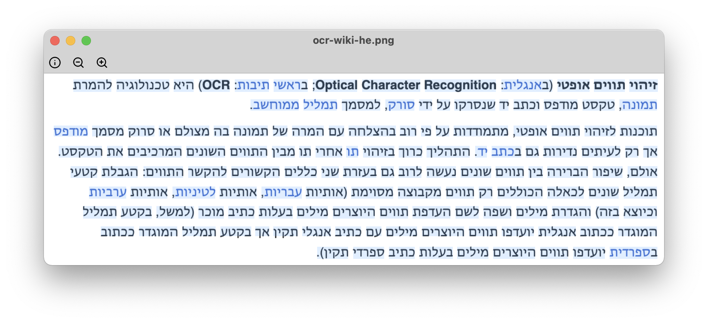

# Preview OCR

A small image viewer made with PyQt and Tesseract. OCR supported in English and Hebrew.

## Example



The OCR Result:

&#x202b;
```
זיהוי תווים אופטי (באנגלית: ;Optical Character Recognition‏ בראשי תיבות: (OCR‏ היא טכנולוגיה להמרת
תמונה, טקסט מודפס וכתב יד שנסרקו על ידי סורק, למסמך תמליל ממוחשב.
תוכנות לזיהוי תווים אופטי, מתמודדות על פי רוב בהצלחה עם המרה של תמונה בה מצולם או סרוק מסמך מודפס
אך רק לעיתים נדירות גם בכתב יד. התהליך כרוך בזיהוי תו אחרי תו מבין התווים השונים המרכיבים את הטקסט.
אולם, שיפור הברירה בין תווים שונים נעשה לרוב גם בעזרת שני כללים הקשורים להקשר התווים: הגבלת קטעי
תמליל שונים לכאלה הכוללים רק תווים מקבוצה מסוימת (אותיות עבריות, אותיות לטיניות, אותיות ערביות
וכיוצא בזה) והגדרת מילים ושפה לשם העדפת תווים היוצרים מילים בעלות כתיב מוכר (למשל, בקטע תמליל
המוגדר ככתוב אנגלית יועדפו תווים היוצרים מילים עם כתיב אנגלי תקין אך בקטע תמליל המוגדר ככתוב
בספרדית יועדפו תווים היוצרים מילים בעלות כתיב ספרדי תקי)).
```

## Prerequisites

You must install Tesseract before you begin:

```
sudo apt install tesseract-ocr libtesseract-dev tesseract-ocr-heb
```
